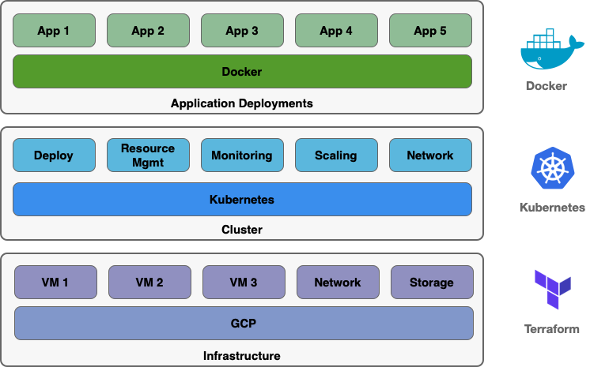
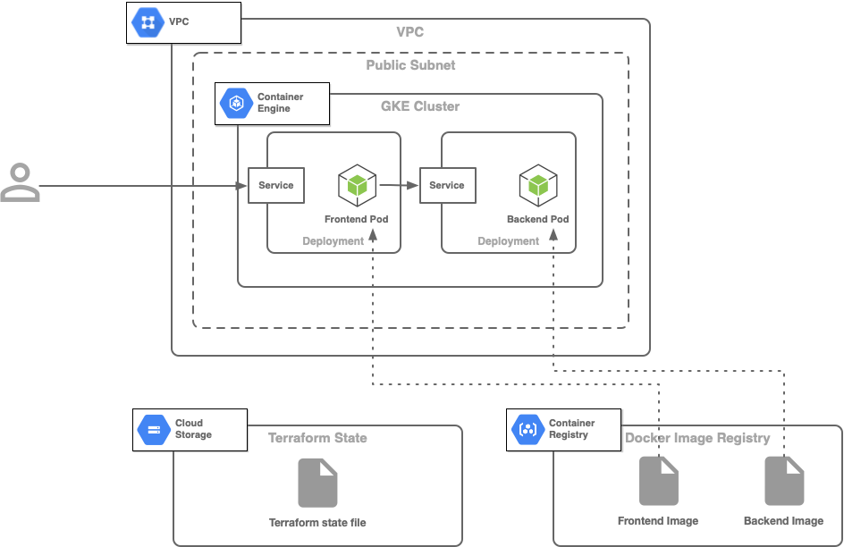

# Terraform GKE

This is a simple Terraform project that was used in the demo for my talk "Terraforming on GCP" talk at the Google Cloud Platform LA Meetup at Google Playa Vista, Nov 6, 2019.

In the talk, I mentioned that infrastructure as code (IaC) works on different abstract levels of a system. And there are tools available at each of these levels. Combine different tools to best meet your needs. 



This project demonstrates how IaC tools operate at the Cloud infrastructure, cluster, and application deployment levels. This project provision the following system on GCP:

* VPC network
* Public subnetwork
* GKE cluster with a node pool compromised of 3 nodes

We also save the Terraform state file in a centralized Google Cloud Storage (GCS) bucket for multi-person/team setting. Once we have the infrastructure resources and Kubernetes cluster set up, we deploy the [Hello World](https://kubernetes.io/docs/tasks/access-application-cluster/connecting-frontend-backend/) application Docker images to the cluster. The Docker images are pulled from Google Container Registry (GCR), although any public Docker registry should work. The Kubernetes manifest files needed for deployment can be found in the [test](tests) folder.



## Setup

1. Install client tools (only Mac setup for now).

   ```bash
   $ brew cask install google-cloud-sdk
   $ gcloud components install kubectl
   ```

1. Authorize for GCP.

   ```bash
   $ export PROJECT_ID='<PROJECT_ID>'  # Enter your GCP project ID here
   $ gcloud init
   $ gcloud auth login
   $ gcloud config set project "${PROJECT_ID}"
   ```
   
1. Create a GCS bucket as a centralized location to save the terraform state.

   ```bash
   $ cd scripts
   $ ./create-bucket-tfstate.sh
   ```

1. Enter the GCP Project ID in `terraform.tfvars` and `backend.tf` by running a script. The script will replace the text placeholder `<PROJECT_ID>` in the 2 files with value in environment variable `PROJECT_ID`.

   ```bash
   $ ./replace-project-id.sh
   ```
   
1. Run terraform commands.

   ```bash
   $ ../dev
   $ terraform init     # Download providers and external modules
   $ terraform plan     # Display configurations and what resources will be affected 
   $ terraform apply    # Deploy your infrastructure
   ```
   
1. Set up `kubectl` to the minted cluster. You should be able to get the cluster name from the output of `terraform apply`.

   ```bash
   $ # The gcloud command will get the credentials and pass them to kubectl
   $ gcloud container clusters get-credentials <CLUSTER_NAME> --region <REGION>
   $ # Verify that the current context to is set to the new cluster
   $ kubectl config current-context
   gke_<PROJECT_ID>_us-west1_<CLUSTER_NAME>
   $ # You should see a similar output above
   ```   
   
1. If `kubectl` test the infrastructure by deploying Docker images to the clusters.

   ```bash
   $ cd ../tests
   $ ./test-cluster.sh  # Deploy Docker containers using the yaml manifest files
   $ # The creation of an external IP address can take a while. Run the following command
   $ # to check the status.
   $ kubectl get service frontend --watch
   $ # Run the following command once IP address has been created
   $ curl "http://$(kubectl get service frontend | awk 'FNR==2 {print $4}')"
   {"message":"Hello"}
   $ # Success if you see the above output
   ```
   
1. When you done, destroy the infrastructure that Terrafrom